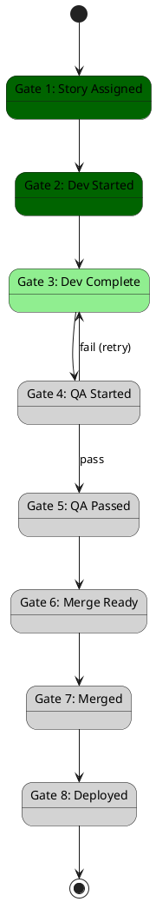

# Gate 0 Research Report: Item #6 - BPMN Visualization Tools

## Overview

**Item:** BPMN Visualization Tools
**Proposed by:** Grok
**Researcher:** Claude Opus 4.5
**Date:** 2026-01-28
**Status:** Research Complete - **VALIDATED**

---

## 1. Current State Analysis

### WAVE Workflow Structure

From `graph.py`:
```python
class Phase(str, Enum):
    VALIDATE = "validate"
    PLAN = "plan"
    DEVELOP = "develop"
    QA = "qa"
    MERGE = "merge"
    DONE = "done"
    FAILED = "failed"

class Gate(int, Enum):
    STORY_ASSIGNED = 1
    DEV_STARTED = 2
    DEV_COMPLETE = 3
    QA_STARTED = 4
    QA_PASSED = 5
    MERGE_READY = 6
    MERGED = 7
    DEPLOYED = 8
```

### Current Visualization

None. The workflow is documented in markdown but there's no programmatic visualization.

---

## 2. Why This Matters

### Benefits of BPMN Visualization

1. **Debugging**: See current workflow state visually
2. **Documentation**: Auto-generate up-to-date diagrams
3. **Monitoring**: Show workflow progress in Dozzle/Slack
4. **Onboarding**: Help new developers understand the system

---

## 3. Recommendation: PlantUML BPMN Generator

### Why PlantUML?

| Feature | PlantUML | Mermaid | Custom SVG |
|---------|----------|---------|------------|
| Markdown embedding | Yes | Yes | No |
| BPMN support | Yes | No | Manual |
| URL encoding | Yes | No | No |
| No dependencies | Yes (server) | Yes | Yes |
| State highlighting | Yes | Limited | Yes |

PlantUML can be rendered via:
- Local server: `java -jar plantuml.jar`
- Public server: `http://www.plantuml.com/plantuml/svg/`
- GitHub markdown: Auto-rendered in README

---

## 4. Implementation Architecture

```
┌─────────────────────────────────────────────────────────────┐
│                  BPMN Generator                              │
├─────────────────────────────────────────────────────────────┤
│  1. Parse workflow state (current gate, phase)              │
│  2. Generate PlantUML diagram source                        │
│  3. Highlight current state                                 │
│  4. Return diagram URL or source                            │
│  5. Embed in Slack notifications / logs                     │
└─────────────────────────────────────────────────────────────┘
```

---

## 5. TDD Implementation Plan

### Tests to Write FIRST

```python
class TestBPMNGenerator:

    def test_generate_returns_plantuml_source(self):
        """Should return valid PlantUML source."""
        from src.visualization.bpmn import generate_workflow_diagram

        source = generate_workflow_diagram()

        assert "@startuml" in source
        assert "@enduml" in source

    def test_highlight_current_gate(self):
        """Should highlight current gate."""
        from src.visualization.bpmn import generate_workflow_diagram

        source = generate_workflow_diagram(current_gate=3)

        assert "DEV_COMPLETE" in source
        # Current state should be highlighted
        assert "#lightgreen" in source or "<<active>>" in source

    def test_generate_url(self):
        """Should generate PlantUML server URL."""
        from src.visualization.bpmn import get_diagram_url

        url = get_diagram_url(current_gate=5)

        assert "plantuml.com" in url or "localhost" in url
```

---

## 6. Files to Create

| File | Purpose |
|------|---------|
| `src/visualization/__init__.py` | Package init |
| `src/visualization/bpmn.py` | BPMN generator |
| `tests/test_bpmn_generator.py` | TDD tests |

---

## 7. Example Output

### PlantUML Source



### Rendered URL

```
http://www.plantuml.com/plantuml/svg/~1UDgAqh...
```

---

## 8. Integration Points

### Slack Notifications

```python
# In notifications.py
def notify_gate_transition(story_id: str, from_gate: int, to_gate: int):
    diagram_url = get_diagram_url(current_gate=to_gate)
    blocks = [
        {"type": "section", "text": {"type": "mrkdwn", "text": f"*{story_id}* moved to Gate {to_gate}"}},
        {"type": "image", "image_url": diagram_url, "alt_text": "Workflow diagram"}
    ]
    # Send to Slack
```

### Dozzle/Logs

```python
# In agent_worker.py
def log_workflow_state(state):
    diagram = generate_workflow_diagram(current_gate=state["gate"])
    print(f"[WORKFLOW] Current state:\n{diagram}")
```

---

## 9. Conclusion

| Aspect | Finding |
|--------|---------|
| Grok's Recommendation | **VALIDATED** |
| Current Gap | No workflow visualization |
| Impact | MEDIUM - Aids debugging and monitoring |
| Effort | LOW - 20 minutes |
| Risk | LOW - Additive feature |

**Implementation Ready:** Yes, proceed with TDD.

---

## 10. PlantUML Encoding

PlantUML URLs use a custom encoding. Here's the Python implementation:

```python
import zlib
import base64

def encode_plantuml(source: str) -> str:
    """Encode PlantUML source for URL."""
    compressed = zlib.compress(source.encode('utf-8'), 9)
    # PlantUML uses a modified base64
    b64 = base64.b64encode(compressed).decode('ascii')
    # Replace characters for URL safety
    return b64.replace('+', '-').replace('/', '_').replace('=', '')

def get_plantuml_url(source: str, server: str = "http://www.plantuml.com/plantuml") -> str:
    """Generate PlantUML server URL."""
    encoded = encode_plantuml(source)
    return f"{server}/svg/{encoded}"
```
