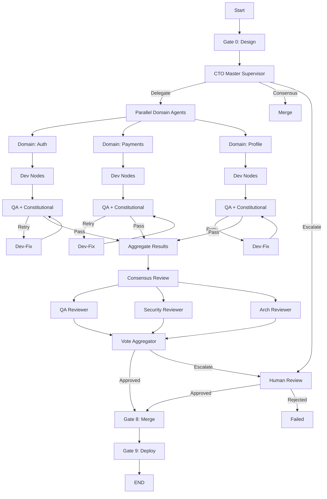

# LangGraph Multi-Agent Enhancement Plan

**Date:** 2026-01-25
**Based On:** Grok's LangGraph Multi-Agent Patterns Guide
**Current Status:** Basic graph implemented, 145 tests passing
**Target:** Full pattern implementation for production-grade multi-agent system

---

## Executive Summary

This plan enhances the WAVE orchestrator to implement all 6 LangGraph multi-agent patterns recommended by Grok:

1. **Hierarchical (Supervisor + Workers)** - Partially implemented, needs enhancement
2. **Parallel Execution (Map/Reduce)** - Not implemented
3. **Cyclic/Retry Loops** - Basic, needs Dev-Fix node
4. **Consensus/Multi-Actor Review** - Not implemented
5. **Human-in-the-Loop** - Basic, needs proper pause/resume
6. **Tool Delegation** - Implemented via ToolNode

---

## Gap Analysis

### Current Implementation

```
Current Graph Flow:
START -> supervisor -> [pm|cto|dev|qa] -> safety_gate -> qa -> supervisor -> END

Features:
- Basic supervisor routing ✓
- Sequential agent execution ✓
- Safety gate checkpoint ✓
- QA retry loop (basic) ✓
- Constitutional scoring ✓
```

### Missing Patterns

| Pattern | Current Status | Gap |
|---------|---------------|-----|
| Hierarchical | Basic supervisor | No worker delegation, no domain isolation |
| Parallel | None | No map/reduce, no parallel domains |
| Cyclic/Retry | Basic QA retry | No Dev-Fix agent, no backoff |
| Consensus | None | No multi-reviewer, no vote aggregation |
| Human-in-Loop | Flag only | No proper pause/resume/interrupt API |
| Tool Delegation | Basic | Not using LangGraph ToolNode |

---

## Enhancement Plan

### Phase 1: Enhanced Supervisor Pattern (Week 1)

**Objective:** Implement true hierarchical delegation with CTO Master as supervisor.

#### Step 1.1: Create Domain Sub-graphs

```python
# File: src/domains/domain_graph.py

from langgraph.graph import StateGraph, START, END

def create_domain_subgraph(domain: str) -> StateGraph:
    """Create a sub-graph for a single domain (auth, payments, etc.)"""

    graph = StateGraph(DomainState)

    # Domain-specific agents
    graph.add_node("domain_cto", domain_cto_node)
    graph.add_node("domain_pm", domain_pm_node)
    graph.add_node("fe_dev_1", fe_dev_node)
    graph.add_node("fe_dev_2", fe_dev_node)
    graph.add_node("be_dev_1", be_dev_node)
    graph.add_node("be_dev_2", be_dev_node)
    graph.add_node("domain_qa", domain_qa_node)

    # Domain workflow
    graph.add_edge(START, "domain_cto")
    graph.add_edge("domain_cto", "domain_pm")
    graph.add_edge("domain_pm", "fe_dev_1")  # Or parallel
    graph.add_edge("fe_dev_1", "domain_qa")
    graph.add_conditional_edges("domain_qa", domain_qa_route)

    return graph
```

#### Step 1.2: Enhanced Supervisor Node

```python
# File: nodes/supervisor_v2.py

def supervisor_node(state: WAVEState) -> dict:
    """
    CTO Master Supervisor - routes and delegates to domain teams.

    Responsibilities:
    1. Analyze incoming story
    2. Determine affected domain(s)
    3. Delegate to appropriate domain sub-graph
    4. Aggregate results from domains
    5. Handle cross-domain conflicts
    """

    # Determine routing based on story analysis
    domains_affected = analyze_story_domains(state["requirements"])

    if len(domains_affected) == 1:
        return {"next_agent": f"domain_{domains_affected[0]}"}
    elif len(domains_affected) > 1:
        return {"next_agent": "parallel_domains", "domains": domains_affected}
    else:
        return {"next_agent": "END", "error": "No domain identified"}
```

#### Step 1.3: Test Cases

```python
# File: tests/test_c1_hierarchical.py

def test_supervisor_delegates_to_domain():
    """Supervisor should route to correct domain sub-graph"""

def test_supervisor_handles_multi_domain():
    """Supervisor should trigger parallel execution for multi-domain stories"""

def test_domain_reports_back_to_supervisor():
    """Domain sub-graph should return results to supervisor"""
```

**Deliverables:**
- [ ] `src/domains/domain_graph.py` - Domain sub-graph factory
- [ ] `nodes/supervisor_v2.py` - Enhanced supervisor
- [ ] `tests/test_c1_hierarchical.py` - 10+ tests
- [ ] Update main graph to use new supervisor

---

### Phase 2: Parallel Execution (Week 2)

**Objective:** Implement map/reduce for parallel domain execution.

#### Step 2.1: Parallel Domain Agents

```python
# File: src/parallel/domain_executor.py

from langgraph.graph import StateGraph

def create_parallel_domain_graph() -> StateGraph:
    """
    Fan-out to multiple domains, fan-in to merge supervisor.

    Pattern:
    supervisor -> [domain_a, domain_b, domain_c] -> merge_supervisor -> END
    """

    graph = StateGraph(ParallelState)

    # Fan-out: Map over domains
    graph.add_node("parallel_domains", parallel_domain_executor)

    # Fan-in: Reduce/aggregate results
    graph.add_node("merge_supervisor", merge_results_node)

    # Edges
    graph.add_edge(START, "parallel_domains")
    graph.add_edge("parallel_domains", "merge_supervisor")
    graph.add_edge("merge_supervisor", END)

    return graph


async def parallel_domain_executor(state: ParallelState) -> dict:
    """Execute domains in parallel using asyncio.gather"""

    domains = state["domains"]
    tasks = []

    for domain in domains:
        subgraph = create_domain_subgraph(domain)
        compiled = subgraph.compile()
        tasks.append(compiled.ainvoke(state))

    # Run all domains in parallel
    results = await asyncio.gather(*tasks)

    return {"domain_results": results}
```

#### Step 2.2: LangGraph Map Pattern

```python
# Alternative: Using LangGraph's built-in map

from langgraph.graph import StateGraph

def create_mapped_graph() -> StateGraph:
    """Use LangGraph's .map() for cleaner parallel execution"""

    graph = StateGraph(WAVEState)

    # Define the mapped node
    @graph.map_node("domain_workers", over="domains")
    def process_domain(state: dict, domain: str) -> dict:
        """Process a single domain - called in parallel"""
        subgraph = create_domain_subgraph(domain)
        return subgraph.compile().invoke(state)

    # Reduce results
    graph.add_node("aggregate", aggregate_domain_results)

    graph.add_edge(START, "domain_workers")
    graph.add_edge("domain_workers", "aggregate")
    graph.add_edge("aggregate", END)

    return graph
```

#### Step 2.3: Test Cases

```python
# File: tests/test_c2_parallel.py

def test_parallel_execution_two_domains():
    """Two domains should execute in parallel"""

def test_parallel_results_aggregated():
    """Results from parallel domains should be merged correctly"""

def test_parallel_handles_one_failure():
    """If one domain fails, others should still complete"""

def test_parallel_respects_budget():
    """Parallel execution should track combined budget"""
```

**Deliverables:**
- [ ] `src/parallel/domain_executor.py` - Parallel executor
- [ ] `src/parallel/aggregator.py` - Result aggregation
- [ ] `tests/test_c2_parallel.py` - 8+ tests

---

### Phase 3: Enhanced Retry/Dev-Fix Loop (Week 3)

**Objective:** Implement proper cyclic retry with dedicated Dev-Fix agent.

#### Step 3.1: Dev-Fix Agent Node

```python
# File: nodes/dev_fix.py

def dev_fix_node(state: WAVEState) -> dict:
    """
    Specialized agent for fixing QA failures.

    Unlike regular dev, this agent:
    1. Analyzes specific QA failure
    2. Generates targeted fix
    3. Tracks retry count with backoff
    4. Escalates after max retries
    """

    qa_feedback = state["qa_feedback"]
    retry_count = state["retry"]["count"]
    max_retries = state["retry"]["max_retries"]

    if retry_count >= max_retries:
        return {
            "next": "escalate_human",
            "escalation_reason": f"Max retries ({max_retries}) exceeded"
        }

    # Generate fix based on QA feedback
    fix_prompt = f"""
    QA Failure: {qa_feedback}
    Original Code: {state["code"]}
    Retry Attempt: {retry_count + 1}/{max_retries}

    Generate a targeted fix for this specific failure.
    """

    fix_code = call_claude(fix_prompt)

    return {
        "code": fix_code,
        "retry": {
            **state["retry"],
            "count": retry_count + 1,
            "last_error": qa_feedback
        },
        "next": "qa"  # Go back to QA
    }
```

#### Step 3.2: Retry Routing with Backoff

```python
# File: src/routing/retry_router.py

def qa_retry_router(state: WAVEState) -> str:
    """
    Route after QA with exponential backoff consideration.

    Returns:
    - "cto_master": QA passed
    - "dev_fix": Retry with fix agent
    - "escalate_human": Max retries exceeded
    - "failed": Unrecoverable error
    """

    if state["qa_passed"]:
        return "cto_master"

    retry_count = state["retry"]["count"]
    max_retries = state["retry"]["max_retries"]

    # Check if safety violation caused failure
    if state["safety"]["constitutional_score"] < 0.3:
        return "escalate_human"  # Don't retry unsafe code

    # Check retry limit
    if retry_count >= max_retries:
        return "escalate_human"

    return "dev_fix"
```

#### Step 3.3: Graph with Dev-Fix Cycle

```python
# File: src/graph_v2.py (enhanced)

def create_wave_graph_v2() -> StateGraph:
    """Enhanced graph with proper Dev-Fix cycle"""

    graph = StateGraph(WAVEState)

    # All nodes including dev_fix
    graph.add_node("validate", validate_node)
    graph.add_node("plan", plan_node)
    graph.add_node("develop", develop_node)
    graph.add_node("dev_fix", dev_fix_node)  # NEW
    graph.add_node("constitutional", constitutional_node)
    graph.add_node("qa", qa_node)
    graph.add_node("cto_master", cto_master_node)
    graph.add_node("merge", merge_node)
    graph.add_node("escalate_human", human_escalation_node)  # NEW

    # Edges with Dev-Fix cycle
    graph.add_edge(START, "validate")
    graph.add_conditional_edges("validate", route_from_validate)
    graph.add_edge("plan", "develop")
    graph.add_edge("develop", "constitutional")
    graph.add_edge("constitutional", "qa")

    # QA routes to dev_fix on failure (not develop)
    graph.add_conditional_edges(
        "qa",
        qa_retry_router,
        {
            "cto_master": "cto_master",
            "dev_fix": "dev_fix",  # Cycle to fix agent
            "escalate_human": "escalate_human",
            "failed": END
        }
    )

    # Dev-Fix goes back to QA (cycle)
    graph.add_edge("dev_fix", "constitutional")

    # Human escalation can approve or reject
    graph.add_conditional_edges("escalate_human", human_decision_router)

    graph.add_conditional_edges("cto_master", route_from_cto)
    graph.add_edge("merge", END)

    return graph
```

**Deliverables:**
- [ ] `nodes/dev_fix.py` - Dev-Fix agent
- [ ] `src/routing/retry_router.py` - Enhanced routing
- [ ] `src/graph_v2.py` - Graph with Dev-Fix cycle
- [ ] `tests/test_c3_retry.py` - 10+ tests

---

### Phase 4: Consensus/Multi-Actor Review (Week 4)

**Objective:** Implement multi-reviewer consensus for merge approval.

#### Step 4.1: Reviewer Agents

```python
# File: nodes/reviewers.py

def qa_reviewer_node(state: WAVEState) -> dict:
    """QA reviewer - focuses on test coverage and quality"""
    return {
        "review_qa": {
            "approved": True,
            "score": 0.85,
            "feedback": "Tests comprehensive"
        }
    }

def security_reviewer_node(state: WAVEState) -> dict:
    """Security reviewer - focuses on vulnerabilities"""
    return {
        "review_security": {
            "approved": True,
            "score": 0.90,
            "feedback": "No security issues"
        }
    }

def architecture_reviewer_node(state: WAVEState) -> dict:
    """Architecture reviewer - focuses on design patterns"""
    return {
        "review_architecture": {
            "approved": True,
            "score": 0.80,
            "feedback": "Follows patterns"
        }
    }
```

#### Step 4.2: Consensus Aggregator

```python
# File: src/consensus/aggregator.py

def consensus_aggregator(state: WAVEState) -> dict:
    """
    Aggregate votes from multiple reviewers.

    Consensus rules:
    - All reviewers must approve for auto-merge
    - Average score must be >= 0.8
    - Any score < 0.5 triggers human review
    """

    reviews = [
        state.get("review_qa", {}),
        state.get("review_security", {}),
        state.get("review_architecture", {})
    ]

    all_approved = all(r.get("approved", False) for r in reviews)
    avg_score = sum(r.get("score", 0) for r in reviews) / len(reviews)
    any_low_score = any(r.get("score", 1) < 0.5 for r in reviews)

    if any_low_score:
        return {"consensus": "human_review", "reason": "Low reviewer score"}

    if all_approved and avg_score >= 0.8:
        return {"consensus": "approved", "avg_score": avg_score}

    return {"consensus": "rejected", "avg_score": avg_score}


def consensus_router(state: WAVEState) -> str:
    """Route based on consensus result"""
    consensus = state.get("consensus", "rejected")

    if consensus == "approved":
        return "merge"
    elif consensus == "human_review":
        return "escalate_human"
    else:
        return "failed"
```

#### Step 4.3: Parallel Review Graph

```python
# File: src/consensus/review_graph.py

def create_consensus_graph() -> StateGraph:
    """
    Parallel review with consensus aggregation.

    Pattern:
    ... -> [qa_review, security_review, arch_review] -> consensus -> ...
    """

    graph = StateGraph(WAVEState)

    # Parallel reviewers (using map pattern)
    graph.add_node("qa_reviewer", qa_reviewer_node)
    graph.add_node("security_reviewer", security_reviewer_node)
    graph.add_node("architecture_reviewer", architecture_reviewer_node)

    # Consensus aggregator
    graph.add_node("consensus", consensus_aggregator)

    # Fan-out to reviewers (parallel)
    # Note: LangGraph handles parallel execution automatically
    # when nodes have same source and no dependencies

    # Fan-in to consensus
    graph.add_edge("qa_reviewer", "consensus")
    graph.add_edge("security_reviewer", "consensus")
    graph.add_edge("architecture_reviewer", "consensus")

    # Route based on consensus
    graph.add_conditional_edges("consensus", consensus_router)

    return graph
```

**Deliverables:**
- [ ] `nodes/reviewers.py` - QA, Security, Architecture reviewers
- [ ] `src/consensus/aggregator.py` - Vote aggregation
- [ ] `src/consensus/review_graph.py` - Parallel review sub-graph
- [ ] `tests/test_c4_consensus.py` - 12+ tests

---

### Phase 5: Human-in-the-Loop (Week 5)

**Objective:** Implement proper pause/resume for human escalation.

#### Step 5.1: Human Escalation Node

```python
# File: nodes/human_escalation.py

from langgraph.graph import interrupt

def human_escalation_node(state: WAVEState) -> dict:
    """
    Pause workflow for human review.

    Uses LangGraph's interrupt() to pause execution.
    Human can resume via API with approval/rejection.
    """

    escalation_reason = state.get("escalation_reason", "Unknown")

    # Create escalation request
    escalation_request = {
        "story_id": state["story_id"],
        "reason": escalation_reason,
        "code": state["code"],
        "qa_feedback": state["qa_feedback"],
        "safety_score": state["safety"]["constitutional_score"],
        "retry_count": state["retry"]["count"],
        "requested_at": datetime.now().isoformat()
    }

    # Notify via Slack
    notify_slack_escalation(escalation_request)

    # Pause execution - waits for human input
    human_decision = interrupt(
        value=escalation_request,
        resume_schema={
            "approved": bool,
            "feedback": str,
            "override_reason": str
        }
    )

    # Process human decision
    if human_decision["approved"]:
        return {
            "human_approved": True,
            "human_feedback": human_decision["feedback"],
            "next": "cto_master"
        }
    else:
        return {
            "human_approved": False,
            "human_feedback": human_decision["feedback"],
            "next": "failed"
        }
```

#### Step 5.2: Resume API Endpoint

```python
# File: src/api/endpoints_v2.py

from fastapi import FastAPI, HTTPException

app = FastAPI()

@app.post("/runs/{run_id}/resume")
async def resume_workflow(
    run_id: str,
    decision: HumanDecision
):
    """
    Resume a paused workflow with human decision.

    Called by Portal when human approves/rejects escalation.
    """

    # Get checkpointer
    checkpointer = get_checkpointer()

    # Load state
    config = {"configurable": {"thread_id": run_id}}

    # Resume with human input
    result = await wave_graph.ainvoke(
        None,  # No new input
        config,
        interrupt_resume_value={
            "approved": decision.approved,
            "feedback": decision.feedback,
            "override_reason": decision.override_reason
        }
    )

    return {"status": "resumed", "result": result}


@app.get("/runs/{run_id}/escalation")
async def get_escalation(run_id: str):
    """Get details of a paused escalation for human review"""

    checkpointer = get_checkpointer()
    config = {"configurable": {"thread_id": run_id}}

    # Get current state
    state = await wave_graph.aget_state(config)

    if state.next != ("human_escalation",):
        raise HTTPException(404, "No pending escalation")

    return {
        "run_id": run_id,
        "escalation": state.values.get("escalation_request"),
        "paused_at": state.created_at
    }
```

#### Step 5.3: Portal Integration

```typescript
// Portal: src/components/EscalationReview.tsx

interface EscalationReviewProps {
  runId: string;
  escalation: EscalationRequest;
}

function EscalationReview({ runId, escalation }: EscalationReviewProps) {
  const [feedback, setFeedback] = useState('');

  const handleApprove = async () => {
    await fetch(`/api/orchestrator/runs/${runId}/resume`, {
      method: 'POST',
      body: JSON.stringify({
        approved: true,
        feedback,
        override_reason: 'Human approved'
      })
    });
  };

  const handleReject = async () => {
    await fetch(`/api/orchestrator/runs/${runId}/resume`, {
      method: 'POST',
      body: JSON.stringify({
        approved: false,
        feedback,
        override_reason: ''
      })
    });
  };

  return (
    <div>
      <h2>Escalation Review: {escalation.story_id}</h2>
      <p>Reason: {escalation.reason}</p>
      <pre>{escalation.code}</pre>
      <textarea value={feedback} onChange={e => setFeedback(e.target.value)} />
      <button onClick={handleApprove}>Approve</button>
      <button onClick={handleReject}>Reject</button>
    </div>
  );
}
```

**Deliverables:**
- [ ] `nodes/human_escalation.py` - Interrupt-based escalation
- [ ] `src/api/endpoints_v2.py` - Resume API
- [ ] Portal: `EscalationReview.tsx` component
- [ ] `tests/test_c5_human_loop.py` - 8+ tests

---

### Phase 6: 10-Gate System (Week 6)

**Objective:** Expand from 8 gates to full 10-gate launch sequence.

#### Step 6.1: Enhanced Gate Enum

```python
# File: src/gates/gate_system.py

from enum import IntEnum

class Gate(IntEnum):
    """WAVE 10-Gate Launch Sequence"""

    # Design Foundation (Gate 0)
    DESIGN_VALIDATED = 0

    # PRD & Stories (Gate 1)
    STORY_ASSIGNED = 1

    # Execution Plan (Gate 2)
    PLAN_APPROVED = 2

    # Development (Gates 3-4)
    DEV_STARTED = 3
    DEV_COMPLETE = 4

    # QA (Gate 5)
    QA_PASSED = 5

    # Safety (Gate 6 - Aerospace checkpoint)
    SAFETY_CLEARED = 6

    # Review (Gate 7)
    REVIEW_APPROVED = 7

    # Merge (Gate 8)
    MERGED = 8

    # Launch (Gate 9)
    DEPLOYED = 9


# Gate dependencies
GATE_DEPENDENCIES = {
    Gate.STORY_ASSIGNED: [Gate.DESIGN_VALIDATED],
    Gate.PLAN_APPROVED: [Gate.STORY_ASSIGNED],
    Gate.DEV_STARTED: [Gate.PLAN_APPROVED],
    Gate.DEV_COMPLETE: [Gate.DEV_STARTED],
    Gate.QA_PASSED: [Gate.DEV_COMPLETE],
    Gate.SAFETY_CLEARED: [Gate.QA_PASSED],
    Gate.REVIEW_APPROVED: [Gate.SAFETY_CLEARED],
    Gate.MERGED: [Gate.REVIEW_APPROVED],
    Gate.DEPLOYED: [Gate.MERGED],
}
```

#### Step 6.2: Gate Nodes

```python
# File: nodes/gate_nodes.py

def gate_0_design_node(state: WAVEState) -> dict:
    """Gate 0: Validate design foundation"""
    # Check mockups exist
    # Check PRD exists
    # Check folder structure
    return {"gate": Gate.DESIGN_VALIDATED}

def gate_6_safety_node(state: WAVEState) -> dict:
    """Gate 6: Aerospace safety checkpoint"""
    # Run constitutional scorer
    # Check for security vulnerabilities
    # Verify no forbidden operations

    score = state["safety"]["constitutional_score"]

    if score >= 0.9:
        return {"gate": Gate.SAFETY_CLEARED}
    else:
        return {"next": "escalate_human", "reason": "Safety score too low"}

def gate_9_deploy_node(state: WAVEState) -> dict:
    """Gate 9: Final deployment"""
    # Trigger CI/CD
    # Update RLM summary
    # Notify stakeholders
    return {"gate": Gate.DEPLOYED, "phase": Phase.DONE}
```

**Deliverables:**
- [ ] `src/gates/gate_system.py` - 10-gate enum and dependencies
- [ ] `nodes/gate_nodes.py` - Gate-specific validation nodes
- [ ] Update graph to include all 10 gates
- [ ] `tests/test_c6_gates.py` - Gate transition tests

---

## Implementation Schedule

| Phase | Week | Focus | Tests |
|-------|------|-------|-------|
| 1 | Week 1 | Hierarchical Supervisor | 10 |
| 2 | Week 2 | Parallel Execution | 8 |
| 3 | Week 3 | Dev-Fix Retry Loop | 10 |
| 4 | Week 4 | Consensus Review | 12 |
| 5 | Week 5 | Human-in-the-Loop | 8 |
| 6 | Week 6 | 10-Gate System | 10 |
| **Total** | **6 weeks** | **Full Pattern Suite** | **58+** |

---

## Final Architecture Diagram



---

## Test Summary

After all phases, the test structure will be:

```
tests/
├── test_a1_directory_structure.py    # 10 tests (existing)
├── test_a2_dependencies.py           # 9 tests (existing)
├── test_a3_config.py                 # 5 tests (existing)
├── test_a4_state_schema.py           # 34 tests (existing)
├── test_a5_agent_nodes.py            # 22 tests (existing)
├── test_a6_langgraph.py              # 11 tests (existing)
├── test_a7_fastapi.py                # 15 tests (existing)
├── test_b1_constitutional_scorer.py  # 25 tests (existing)
├── test_b2_b3_safety_integration.py  # 14 tests (existing)
├── test_c1_hierarchical.py           # 10 tests (NEW)
├── test_c2_parallel.py               # 8 tests (NEW)
├── test_c3_retry.py                  # 10 tests (NEW)
├── test_c4_consensus.py              # 12 tests (NEW)
├── test_c5_human_loop.py             # 8 tests (NEW)
└── test_c6_gates.py                  # 10 tests (NEW)

TOTAL: 145 existing + 58 new = 203 tests
```

---

## Success Criteria

| Metric | Target |
|--------|--------|
| Test Coverage | 203+ tests passing |
| Pattern Coverage | All 6 LangGraph patterns |
| Gate Coverage | 10/10 gates implemented |
| Parallel Domains | 3+ domains can run simultaneously |
| Retry Resilience | Max 3 retries with backoff |
| Consensus Threshold | 3 reviewers, 80% approval |
| Human Loop Latency | < 1s pause/resume |

---

## Next Steps

1. **Review this plan** with Grok
2. **Start Phase 1** - Hierarchical Supervisor
3. **Create feature branch** for each phase
4. **Update GROK-IMPLEMENTATION-SUMMARY.md** as phases complete

---

**Prepared for Implementation**
**WAVE v3 Enhancement Plan - 2026-01-25**
